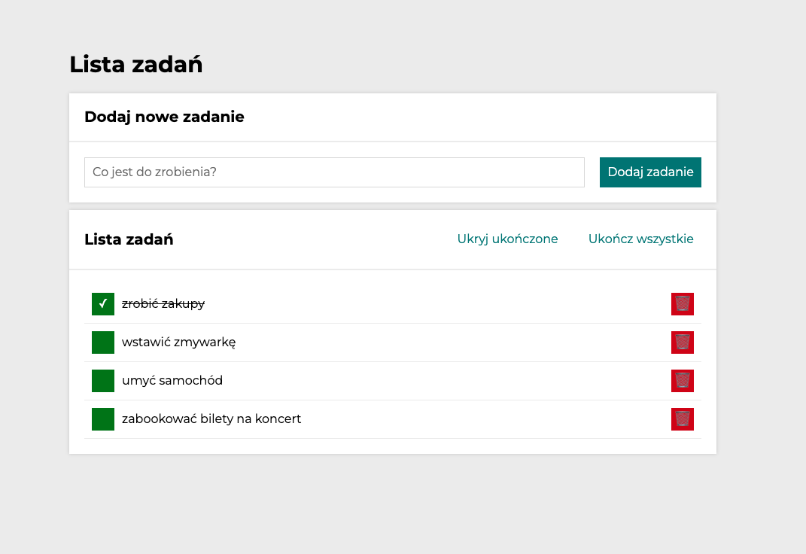
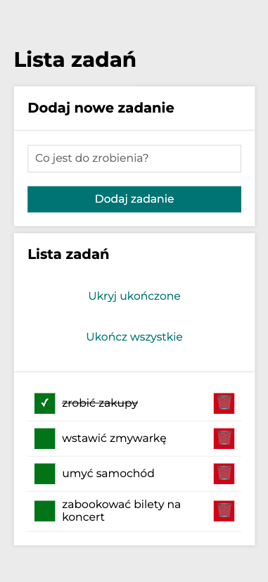

# To do list - in React.js
### **Your daily task assistant**

**To do list** is a simple task assistant application. Whenever you go to do the shopping or get some things to done my app is at your side. It's very simple and versatile in use. For now it's only visual version, for sure this repository will be developed with logic in the nearest future, so don't bother yourself to search other "to-do-lists" and visit us soon to check out the updates.

**This project was bootstrapped with [Create React App](https://github.com/facebook/create-react-app).**
## Features

- Simple, transparent and minimalistic design
- Easy and intuitive to use
- Versatile and universal application (without interactions for now)
- Responsive on any device due to media queries
- Buttons appearance depends of actual state

## Used technologies and conventions

- **React.js** Components, JSX, React DOM
- **Create React App**
- **npm**
- **Node.js**
- **Babel** transform JSX
- **JS ES6 Features:** (arrays, methods, spread syntax, objects, arrow functions, immutabililty, merging)
- **BEM** convention
- **camelCase** class and functions naming
- **CSS:** (normalize.css) applied
- **CSS:** (border-box: box-sizing) applied
- **CSS:** Grid
- **CSS:** Transform and transitions

Below you can seen how does the application look on **mobile devices**:

## Available Scripts

In the project directory, you can run:

### `npm start`

Runs the app in the development mode.\
Open [http://localhost:3000](http://localhost:3000) to view it in your browser.

The page will reload when you make changes.\
You may also see any lint errors in the console.

### `npm run build`

Builds the app for production to the `build` folder.\
It correctly bundles React in production mode and optimizes the build for the best performance.

The build is minified and the filenames include the hashes.\
Your app is ready to be deployed!

See the section about [deployment](https://facebook.github.io/create-react-app/docs/deployment) for more information.

### `npm run eject`

**Note: this is a one-way operation. Once you `eject`, you can't go back!**

If you aren't satisfied with the build tool and configuration choices, you can `eject` at any time. This command will remove the single build dependency from your project.

Instead, it will copy all the configuration files and the transitive dependencies (webpack, Babel, ESLint, etc) right into your project so you have full control over them. All of the commands except `eject` will still work, but they will point to the copied scripts so you can tweak them. At this point you're on your own.

You don't have to ever use `eject`. The curated feature set is suitable for small and middle deployments, and you shouldn't feel obligated to use this feature. However we understand that this tool wouldn't be useful if you couldn't customize it when you are ready for it.