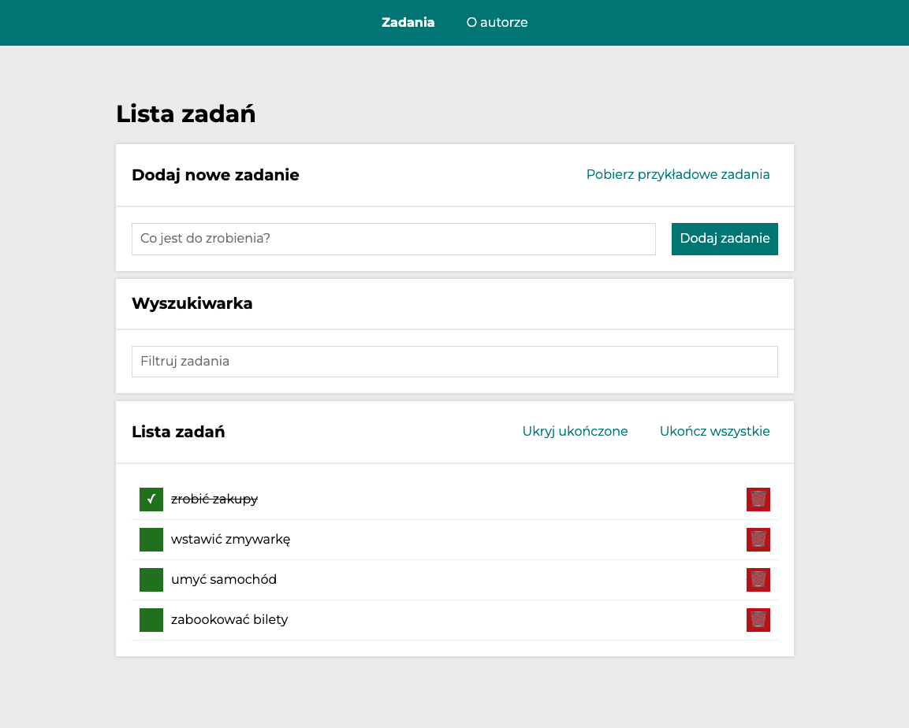
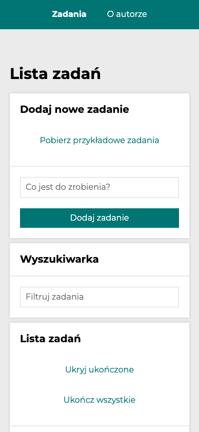

# 📝&nbsp; To do list - in React.js

### **Your daily task assistant**

**To do list** is a simple task assistant application. Whenever you go to do the shopping or get some things to done my app is at your side. It's very simple and versatile in use. You can find below in a few quick steps how to apply its full potential. The construction of this app is based on React.js framework using TypeScript language. For sure this repository will be developed in the nearest future, so don't bother yourself to search other "to-do-lists" and visit us soon to check out the updates.

### **[To do list - in React.js - App link](https://traczoskar.github.io/to_do_list_react/)**

## 🌱&nbsp; Features

- 👨🏻‍🎨&nbsp; Simple, transparent and minimalistic design
- 👶&nbsp; Easy and intuitive to use
- 🚀&nbsp; Quick response to every action that user takes with the buttons
- 👔&nbsp; Versatile and universal application
- 📱&nbsp; Responsive on any device due to media queries
- ⏯&nbsp; Buttons are interactive and its appearance depends of actual state
- ✅&nbsp; You can mark any task that is done, hide/show done tasks, and mark all done with one button
- 💽&nbsp; Your actual task list is saved in your local storage and fetched whenever you refresh the app or close the window
- ⬇️&nbsp; You can download example tasks using fetch shot from Redux-Saga
- 🔎&nbsp; You can filter the tasks by content using search input
- 📄&nbsp; You can check indiviual subpage for every task
- 🪢&nbsp; Two main pages built with ReactRouter: TaskList/Author

## 🤔&nbsp; How to use

**1.** Input the name of your task or shopping item that you want to add to your list. / or download example tasks using button i right upper corner of the app.

**2.** _"Click"_ adding the task button on the right side of the input - "_Dodaj zadanie_".

**3.** The task will show up on the list below.

**4.** Now you can use toggle the task to be _"done"_ using the green button on its left side. The task will be crossed off and the button will get tick icon.

**5.** You can easily delete your task using the red _"remove"_ button with waste bucket icon on the right side.

**6.** After you add a task, there will be able 2 additional options: "Hide/Show tasks that are done" and "Finish all tasks".

**7.** You can filter your tasks and search the exact one you want by typing task content in the form field above the tasks.

**8.** You can read additional info about the author in the second page switch on the navber in the page header.

**9.** You can check the individual task status by clicking on task content. App will redirect you to the subpage.

**10.** Use those options to manage your list easier.

## 🛠&nbsp; Used technologies and conventions

- **TypeScript**
- **React.js** - Components, JSX, React DOM
- **React Hooks** - useState, useEffect, useRef
- **React Router:** app routing managing
- **Redux:** state managing
- **Redux Toolkit**
- **Redux-Saga:** side effects handling
- **styled-components**
- **Create React App**
- **npm**
- **JS ES6 Features:** (arrays, methods, spread syntax, objects, arrow functions, immutabililty, merging)
- **JS Async** - setInterval, setTimeOut
- **localStorage** - tasks saved and fetched
- **BEM** convention
- **camelCase** class and functions naming
- **CSS:** (normalize.css) applied
- **CSS:** (border-box: box-sizing) applied
- **CSS:** Grid
- **CSS:** Transform and transitions

Below you can seen how does the application look on 📲 **mobile devices**:

**This project was bootstrapped with [Create React App](https://github.com/facebook/create-react-app).**

## Available Scripts

In the project directory, you can run:

### `npm start`

Runs the app in the development mode.\
Open [http://localhost:3000](http://localhost:3000) to view it in your browser.

The page will reload when you make changes.\
You may also see any lint errors in the console.

### `npm run build`

Builds the app for production to the `build` folder.\
It correctly bundles React in production mode and optimizes the build for the best performance.

The build is minified and the filenames include the hashes.\
Your app is ready to be deployed!

See the section about [deployment](https://facebook.github.io/create-react-app/docs/deployment) for more information.

### `npm run eject`

**Note: this is a one-way operation. Once you `eject`, you can't go back!**

If you aren't satisfied with the build tool and configuration choices, you can `eject` at any time. This command will remove the single build dependency from your project.

Instead, it will copy all the configuration files and the transitive dependencies (webpack, Babel, ESLint, etc) right into your project so you have full control over them. All of the commands except `eject` will still work, but they will point to the copied scripts so you can tweak them. At this point you're on your own.

You don't have to ever use `eject`. The curated feature set is suitable for small and middle deployments, and you shouldn't feel obligated to use this feature. However we understand that this tool wouldn't be useful if you couldn't customize it when you are ready for it.
